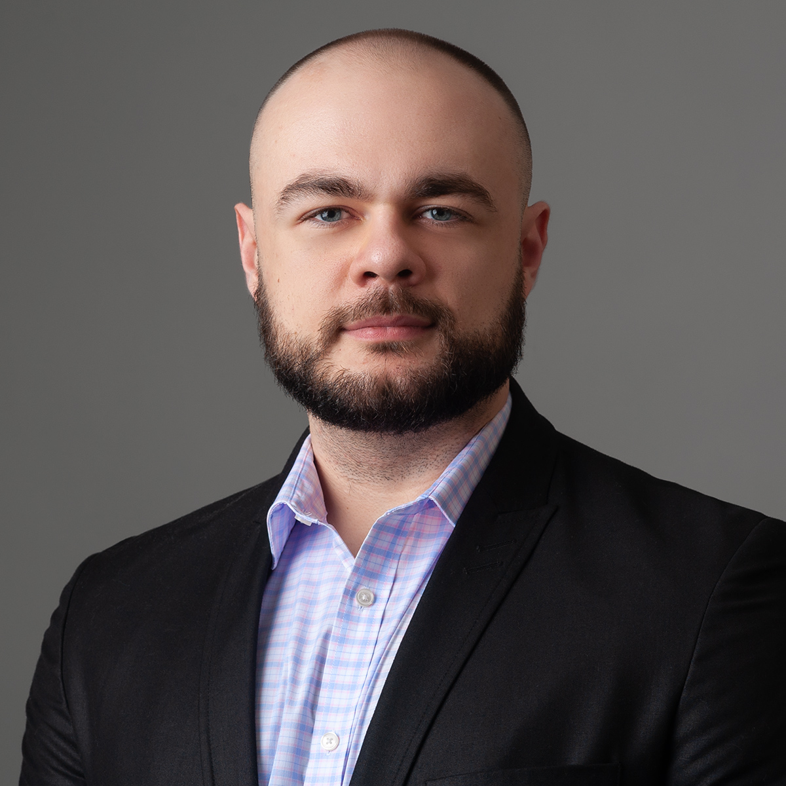

# Ryan Strickler

<picture>
    
</picture>

## Contact Information

Email: ryan.strickler.1993@gmail.com  
Phone: (352) 459-5396  
[LinkedIn](www.linkedin.com/in/ryan-strickler)  
[Github](https://github.com/ryans93)  
[Portfolio](https://ryans93.github.io/)

## Summary

&emsp;I have a background in software development and spent several years as a teaching assistant in a full-stack program, where I focused heavily on debugging and helping students troubleshoot issues across the stack. That gave me a strong foundation in understanding how systems behave and how to identify and fix problems efficiently.  
&emsp;I also worked as a software engineering intern at Lockheed Martin, where I contributed to a production scheduling application. After taking some time for family caregiving, I’m now looking to re-enter the field, with a focus on QA and software testing roles that align with my strengths in debugging and system analysis, while continuing to grow in technical roles over time.

## Technical Skills

**Testing & Debugging:** Manual Testing, Debugging, Test Case Validation, Defect Identification  
**Languages:** JavaScript, TypeScript, Python, HTML, CSS  
**Frameworks & Tools:** React, Node.js, Express, Git, REST APIs  
**Databases:** MySQL, PostgreSQL, MongoDB, Firebase  
**Concepts:** Agile/Scrum, MVC Architecture, API Integration, Object-Oriented Programming  

## Experience

### Software Development Teaching Assistant
*EdX / Orlando, FL / September 2019 - March 2025*
- Debugged and guided development of 100+ full-stack web applications (MERN stack), identifying issues across frontend, backend, and database layers
- Diagnosed and resolved common and edge-case bugs in JavaScript, React, Node.js, and SQL-based systems
- Validated application functionality against expected behavior and project requirements
- Mentored students in troubleshooting techniques, improving their ability to isolate root causes and fix defects

### Software Engineering Intern
*Lockheed Martin / Orlando, FL / July 2018 - August 2019*
- Developed and maintained a C# application used for production scheduling within the Optics Department
- Identified and resolved software defects, improving application stability and usability
- Migrated legacy WPF application to a web-based service using C# and ASP.NET
- Assisted in transitioning data from SQL databases to SAP systems, ensuring data integrity and consistency

## Education

### Associate in Arts (A.A.), Computer Science
*Valencia College - Orlando, FL*
- Member, Phi Theta Kappa Honor Society

### Full-Stack Web Development Certificate
*University of Central Florida - Orlando, FL*
- Completed intensive 24-week MERN stack program
- Technologies: JavaScript, React, Node.js, SQL, MongoDB

## Projects

#### Coming soon...